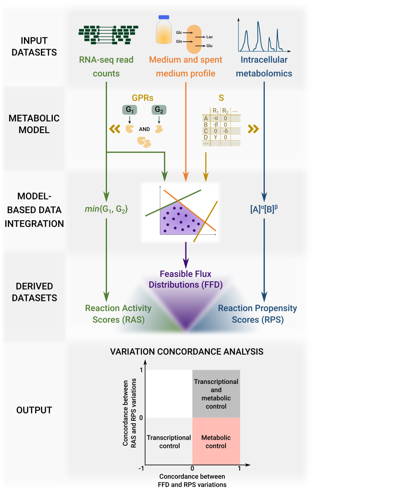

# INTEGRATE: model-based multi-omics data integration to characterize multi-level metabolic regulation

## Overview
The study of metabolism and its regulation is finding increasing application in various fields, including health, wellness, and biotransformations. Complete characterization of regulatory mechanisms controlling metabolism requires knowledge of metabolic fluxes, whose direct determination lags behind other omic technologies, such as metabolomics and transcriptomics. In isolation, these methodologies do not allow accurate characterization of metabolic regulation. Hence, there is a need for integrated methodologies to disassemble the interdependence between different regulatory layers controlling metabolism.
To this aim, we propose a computational pipeline to characterize the landscape of metabolic regulation in different biological samples. The method integrates intracellular and extracellular metabolomics, and transcriptomics, using constraint-based stoichiometric metabolic models as a scaffold. We compute differential reaction expression from transcriptomic data and use constraint-based modeling to predict if the differential expression of metabolic enzymes directly originates differences in metabolic fluxes. In parallel, using metabolomic data, we predict how differences in substrate availability translate into differences in metabolic fluxes. By intersecting these two output datasets, we discriminate fluxes regulated at the metabolic and/or transcriptional level. This information is valuable to better inform targeted action planning in different fields, including personalized prescriptions in multifactorial diseases, such as cancer, and metabolic engineering.

## Installation

* Install Python (from release version 3.0 on)

* Install external libraries through the following commands:
  * for conda users: conda create --name integrate --file integrate_env.txt
  * for all other users: pip install -r integrate_env.txt

* Using terminal, navigate to the favourite installation directory and run the following Git command:
'git clone https://github.com/qLSLab/integrate.git'

* The Pipeline was tested using GLPK solver (https://www.gnu.org/software/glpk/).

## Usage

**Step 1: getGPRsFromModel**  
* Aim: Takes input model and returns the GPR rules associated to each reaction
* Usage: `python pipeline/getGPRsFromModel.py`
* Inputs:  
  Users may decided to leave the following inputs associated to their default values or set them as preferred:
  * modelId: the input model name. Default value: 'ENGRO2'
* Output:
  * File named modelId + '_GPR.csv' containing for each reaction (column *id*) its GPR rule (column *rule*).

**Step 2: getRASscore**
* Aim: generate RAS starting from GPR rules and transcriptomics data
* Usage: `python pipeline/getRASscore.py`
* Inputs:
  Users may decided to leave the following inputs associated to their default values or set them as preferred:
  * gprRule: output file of Step 1. Default value: 'ENGRO2_GPR'
  * rnaSeqFileName = transcriptomics dataset file name. Default value: 'FPKM_Breast_forMarea.tsv'
  * modelId: the input model name. Default value: 'ENGRO2'
  * regexOrgSpecific: define regex to extract genes from GPR rules. Default value: r"([A-Z0-9.]+)" where dot is needed to also extract already computer scores, which are float.
* Output:
  * File named modelId + '_RAS.csv' containing a column including the reactions ID (column *Rxn*), and a column for each cell line in the input transcriptomics dataset corresponding to the computer RAS score.

**Step 3: getNormalizedRAS**
* Aim: normalize RAS scores
* Usage: `python pipeline/getNormalizedRAS.py`
* Inputs:
  Users may decided to leave the following inputs associated to their default values or set them as preferred:
  * inputFileName: output file of Step 2. Default value: 'ENGRO2_RAS'
  * outputFileName: output file name. Default value: 'ENGRO2_wNormalizedRAS'
* Output:
  * File named modelId + 'wNormalizedRAS.csv' containing for each reaction (column *Rxn*) the mean (*mean_XXX* column) and normalized (*norm_XXX* column) RAS for each cell line *XXX*

**Step 4: rasIntegration**
* Aim: integrate RAS scores within the input generic models to generate cell relative models
* Usage: `python pipeline/rasIntegration.py`
* Inputs:
  Users may decided to leave the following inputs associated to their default values or set them as preferred:
  * imposeYSI: 'Y' (yes) or 'N' (no) according to whether extracellular flux ratio constraints have to be integrated. Default value: 'Y'.
  * imposeMedium: 'Y' (yes) or 'N' (no) according to whether nutrients availability constraints have to be integrated. Default value: 'Y'.
  * imposeRasConstraints: 'Y' (yes) or 'N' (no) according to whether transcriptomics derived constraints have to be integrated. Default value: 'Y'.
  * rasNormFileName: output file name of Step 3. Default value: 'ENGRO2_wNormalizedRAS.csv'
  * ysiFileName: the input extracellular flux ratio dataset. This file consists of the following columns: "Ratio" listing the extracellular flux ratios to impose within the model; n columns for each cell line listing for each extracellular flux ratio the corresponding value in each replica. Default value: 'ysi_ratio.csv'.
  * mediumFileName: the input nutrients availability dataset. This file consists of the following columns: "Rxn" listing nutrients uptaken within the model; two columns for each cell line listing for each nutrient the corresponding lower bound (cell line + _LB) and upper bound (cell line + _UB). Default value: 'medium.csv'.
  * modelId: the input model name. Default value: 'ENGRO2'.
  * lcellLines: list of input sample names: Default value: ['MCF102A',  'MDAMB231','SKBR3', 'MCF7', 'MDAMB361'].
  * biomassRxn: biomass reaction name. Default value: 'Biomass'.
  * lacRxn: the lactate demand reaction. Default value: 'EX_lac__L_e'.
  * glcRxn: the glucose uptake reaction. Default value: 'EX_glc__D_e'.
  * glnRxn: the glutamine uptake reaction. Default value: 'EX_gln__L_e'.
  * gluRxn: the glutamate demand reaction. Default value: 'EX_gluOUT__L_e'.
  * lReplicas: list of the sample replicas. Default value: ['_A','_B'].
* Output:
  * A SBML model for each input cell line named as modelId + '_' + cellLineName + '.xml'

**Step 5: Models splitting**
* Aim: Each model needs to be converted to a mat file in order to exploit the MATLAB function to convert model from the reversible into the irreversible format

**Step 6: randomSampling**
* Aim: sample the feasible flux region of each cell relative model
* Usage: `python pipeline/randomSampling.py nSamples nBatches`
* Inputs:
  * nSamples: number of solutions to sample for each batch
  Users may decided to leave the following inputs associated to their default values or set them as preferred:
    * biomassRxn: biomass reaction name. Default value: 'Biomass'.
    * lcellLines: list of input sample names: Default value: ['MCF102A',  'MDAMB231'. 'SKBR3', 'MCF7', 'MDAMB361'].
    * modelId: the input model name. Default value: 'ENGRO2'.
    * ysiFileName: the input extracellular flux ratio dataset. This file consists of the following columns: *Ratio* listing the extracellular flux ratios to impose within the model; n columns for each cell line listing for each extracellular flux ratio the corresponding value in each replica. Default value: 'ysi_ratio.csv'.
    * lacRxn: the lactate demand reaction. Default value: 'EX_lac__L_e'.
    * glcRxn: the glucose uptake reaction. Default value: 'EX_glc__D_e'.
    * glnRxn: the glutamine uptake reaction. Default value: 'EX_gln__L_e'.
    * gluRxn: the glutamate demand reaction. Default value: 'EX_gluOUT__L_e'.
    * lReplicas: list of the sample replicas. Default value: ['_A','_B'].
    * epsilon: lower bound imposed on the biomass synthesis reaction. Default value: 1e-4.
 * nBatches: number of batches
* Output:
  * File named 'randomSampling_' + modelId + '_nSol_' + str(nSamples) + '_' + cellLine + '_' + timeStamp + '.csv' containing the nSamples sampled solutions from each input sample model

**Step 7: mannWhitneyUTest**
* Aim: compute the Mann-Whitney U test
* Usage: `python pipeline/mannWhitneyUTest.py timeStampInput nSamples`
* Inputs:
  * nSamples: number of sampled solutions in Step 6
  Users may decided to leave the following inputs associated to their default values or set them as preferred:
    * lcellLines: list of input sample names: Default value: ['MCF102A', 'SKBR3', 'MCF7', 'MDAMB231', 'MDAMB361'].
    * modelId: the input model name. Default value: 'ENGRO2'.
* Output:
  * For each pair of input cell line c_1 and c_2, a file returning the output of Mann-Whitney U test

**Step 8: RAS t-test**
* Aim: compute the t-test of RAS scores
* Usage: `python pipeline/rasTtest.py`
* Inputs:
  Users may decided to leave the following inputs associated to their default values or set them as preferred:
  * lcellLines: list of input sample names. Default value: ['MCF102A', 'SKBR3', 'MCF7', 'MDAMB231', 'MDAMB361'].
  * rasScoreFile: output file of Step 2. Default value: 'ENGRO2_RAS'
  * modelIrreversible: one of the irreversible models generated during Step 5. Default value: 'ENGRO2_MCF102A_wIrrRxns'
* Outputs:
  * The input rasScoreFile converted so that reversible reactions in the input modelIrreversible file are splitted. The resulting file is named rasScoreFile + '_splt.csv'
  * For each pair of input cell line c_1 and c_2, a file returning the output of t-test named 'ras_' + c_1 +'_vs_' + c_2 + '.csv'
  
**Step 9: Create metabolomic statistical test dataset**
* Aim: create the metabolomic dataset to perform concordance analysis
* Usage: `python pipeline/createMetabolicDataset.py`
* Inputs:
  Users may decided to leave the following inputs associated to their default values or set them as preferred:
  * data_quality_filter: quality filter. Default value: 1
  * valLog: value above which the ratio between the means of two cell lines are considered statistically different. Default value: 1.2
  * namefile: prefix name of the output files. Default value: 'resultsMetabolomic'
  * metabolic_model: the input model name. Default value: 'ENGRO2_irrev.xml'
  * metabolic_data: dataset of metabolites. Default value: 'metabolomics_LM.csv'
  * dict_to_convert_metnames: Conversion file between ID of metabolites in metabolomics dataset and ID of metabolites in the input model. Default value: 'metsEngroVsMetabolomics.csv'
  * output_means: output file name including all the computed means. Default value: 'medie_Met.csv'
* Output:
  * For each pair of input cell line c_1 and c_2, a file returning the output of t-test
  * A file returning the the log2 ratio between the means of each pair of input cell line c_1 and c_2.

**Step 10: Concordance data analysis**
* Aim: create the results (dataset and figures) for concordance analysis
* Usage: `python pipeline/concordanceAnalysis.py`
* Inputs:
  Users may decided to leave the following inputs associated to their default values or set them as preferred:
  * valLog: value above which the ratio between the means of two cell lines are considered statistically different. Default value: 1.2
  * weight: weight on the Kappa Cohen. Default value: 'linear'
  * resultsMetabolomicFile: prefix name of the output files of Step 9. Default value: 'resultsMetabolomic'
  * rxn2Visualize: Name of interesting reaction within the model. Default value: 'ACONT'
  * metabolic_model: the input model name. Default value: 'ENGRO2_irrev.xml'
  * lcellLines: list of input sample names: Default value: ['MCF102A', 'SKBR3', 'MCF7', 'MDAMB231', 'MDAMB361'].
  * biomassRxn: biomass reaction name. Default value: 'Biomass'.
  * meansFile: output file of Step 9. Default value: 'medie_Met.csv'
  * eps: a very close to 0 value to avoid undefined ratios. Default value: 0.00001.
* Output:
  * A dataset of concordance analysis (Cohen coefficient and pearson correlation) of RPS vs RAS, RPS vs FFD, RPS vs FFD, the pvalues and the adjusted pvalues
  * Heatmap showing the RPS vs RAS and the RPS vs FFD concordance scores, for reactions having a level of concordance between RPS and FFD greater than 0.2.
  greater than 0.2.
  * A scatterplot showing RPS vs FFD (x-axis) and the RPS vs RAS (y-axis) scores of the metabolic reactions for which quantification of all substrate
abundances was available.
  * Normalized average RPS and median FFD for all the reactions for which quantification of all substrate abundances was available.

## Getting Help
For support, please contact:
* chiara.damiani@unimib.it
* dario.pescini@unimib.it
* marzia.difilippo@unimib.it
* bruno.galuzzi@unimib.it
